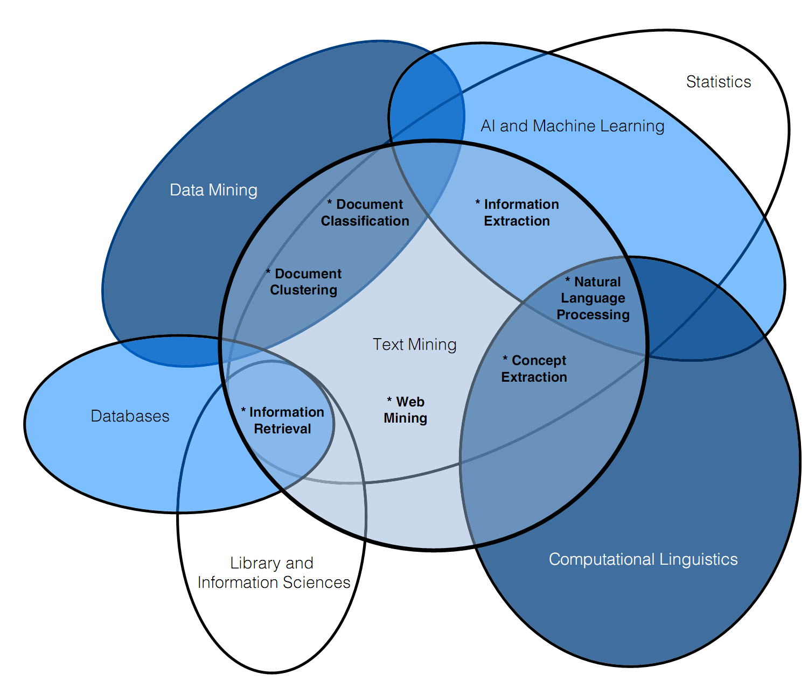

# Introduction {#intro}

In the era of the digital revolution, of frenetic computerization and of the growing and almost annoying presence of the words Intelligence and Artificial in our daily lives, the application of automatic techniques to accompany the comprehension and interpretation of official texts is indisputably topical. In fact, such methods present almost boundless potentialities and their use, although not in-depth, cannot but constitute a good practice that is likely to be interesting.
We have chosen to study the Final Considerations of the Governor on the Annual Reports of the Bank of Italy referring to the years 2008 to 2017, analyzing their style and language, the themes dealt with and the opinions expressed. The description of the data and the reasons behind this choice, together with the presentation of text mining techniques, are dealt with in the following paragraphs of this chapter. In the following one, the objectives of the study are explained. In the third chapter, the methods by which the analysis was carried out are presented in detail. The fourth chapter contains the exposition of the results obtained correlated to their interpretation. In the conclusion section, the study is summarized and critical issues are described.
All the functions created and used, together with the data analyzed, the graphs created, the software used, all the code necessary for the analysis organized by topic, and everything that was useful to complete this work is easily and freely available through my GitHub, in the thesis folder.

## Annual Reports of the Bank of Italy

The Bank of Italy is the central bank of the Italian Republic, with its headquarters in Rome and secondary offices and branches throughout Italy. It is a public-law institution governed by national and European regulations. It is an integral part of the Eurosystem, consisting of the national central banks of the euro area and the European Central Bank.
The Eurosystem and the central banks of the EU Member States that have not adopted the euro make up the European System of Central Banks It pursues purposes of general interest in the monetary and financial sector: the maintenance of price stability, the stability and efficiency of the financial system and other tasks entrusted to it by national law.
The Bank's functional and governance structure reflects the need to rigorously protect its independence from external influences, an essential prerequisite for the effective performance of its institutional action. National and European regulations guarantee the autonomy necessary to pursue the mandate; this autonomy is backed up by stringent duties of transparency and publicity. The Bank is accountable to the Government, Parliament and the public for its work through the dissemination of data and information on institutional activities and the use of resources. [(1)][References]

The publications of the Bank of Italy reflect the activities carried out by the Institute. They are of an economic-financial, historical and legal nature and are all free of charge and available online. Among these, the one that best provides a concise presentation of the country's economic situation is undoubtedly the Annual Report. The latter is published every year at the end of May and contains an in-depth analysis of the main developments in the Italian and international economy in the previous year and in the first months of the current year and is accompanied by a statistical appendix that is only available online. It is also the subject, in a public meeting not limited to Participants, of Considerations by the Governor of the Bank of Italy.
This publication can be defined as a true analytical and informative consultancy on the state of the economy that the Bank of Italy offers to constitutional bodies in matters of economic and financial policy. By virtue of this, it is easy to understand the importance of the Annual Report and how much its content constitutes a perfect summary framework to be used as the basis for a study of the Italian economic situation and its evolution over time.

## Final remarks by the Governor

As already specified, the Annual Report of the Bank of Italy is discussed at a public meeting. On the occasion of its circulation, therefore, the Governor of the Bank of Italy presents the so-called Final Considerations.
The Governor of the Bank of Italy has the task of representing the bank with third parties, presiding over the meeting and informing the Italian government on foreign or domestic financial matters. Until before the introduction of the Euro, he was also responsible for national monetary policy. This function is exercised collegially together with the other central banks of the Euro area.
The Governor is appointed by decree of the President of the Republic, on the proposal of the President of the Council of Ministers, after deliberation by the Council of Ministers, having heard the opinion of the Superior Council of the Bank of Italy. The procedure also applies to the revocation of the Governor. His office, which until 2005 had no term limit, lasts six years and can be renewed once. [(2)][References]
Focusing on the period of interest to us, the Governor in office for the period 2005-2011 was Mario Draghi, who currently holds the prestigious position of President of the European Central Bank, who was succeeded on November 1, 2011 by Ignazio Visco, currently in office.
The Final Considerations referring to 2008, 2009 and 2010, therefore, were drafted by Draghi, while the subsequent seven in analysis (published up to May 2018, therefore referring to the period 2011-2017) are the result of the work of the current Governor.
These publications, available free of charge online, provide a concise and more "human" opinion of the overall economic picture of the country. They are, in fact, actual comments that the Governor is called upon to make in order to take stock of the past year.
For these and other practical reasons, related to the need to use texts as free as possible of multimedia content, we have chosen to analyze the Final Considerations of the Governor of the Bank of Italy referring to the ten years between 2008 and 2017. This will provide a clear idea of the evolution of Italy's economic situation in the reference period from how the latter is presented in the Annual Reports.

## Text mining on complex text sources

Data mining is the set of techniques and methodologies that aim to extract useful information from large amounts of data, through automatic or semi-automatic methods (such as machine learning).
Text mining, also called text data mining or (in some ways incorrectly) text analytics, is a particular form of data mining in which the data consists of natural language texts, in other words "unstructured" documents. Text mining combines language technology with data mining algorithms. The goal is the same: the extraction of implicit information contained in a set of documents.
This discipline, also known by the acronym TM, therefore, deals with the search, analysis and thematic classification of information contained in documents. Unlike most of the data with which statistics works, in textual documents the information is present in the form of free text (sentences and words) and only to a small extent as structured text (tables, graphs, etc.). It must also be said that much of the communication, hence information exchange, between human beings takes place through unstructured documentation (books, newspapers, conversations).
TM is a multidisciplinary field based on different sets of techniques, grouped under the name of information retrieval, data mining, machine learning, statistics, and computational linguistics. Figure 1 shows the interactions between text mining and some of the areas presented. [(3)][References]

```{r, echo=FALSE, fig.cap= "Interaction of Text Mining with other research fields", fig.align="center"}

```

Given the wide range of possible applications of the technique in question, providing an exhaustive and universal description of how the TM process takes place is a particularly difficult task. However, it is possible to recognize some steps:  

- Data collection: first step that involves the collection and selection of documents that may be useful for analysis.  
- Text pre-processing: in which the raw text is adapted into analyzable text. Specifically, pre-processing and cleaning operations are performed to detect and remove anomalies so that the true essence of the available text can be captured and also simply to reduce the size of the data. At this stage, procedures of:  

    - Tokenization, which allows breaking a sequence of characters into units (usually words or phrases) called tokens.  
    - Filtering, in order to remove unnecessary parts of the text.  
    - Lemmatization, which causes the various inflected forms of a word to be grouped together in such a way that they are analyzed as a single entity.  
    - Derivation, which is the process by which a form (theme or word) is created from a pre-existing root or word.  

- Application of text mining techniques: this is the phase of greatest interest, in which textual data (keywords, concepts, verbs, nouns, adjectives, etc.) are extracted using techniques based on different algorithms. Among these, the most popular are:  

    - Text Categorization: represents the beginning of the text analysis process by assigning predefined categories to tokens;  
    - Information Extraction: is a technique that extracts meaningful information from a large amount of text. Usually this information is taken from unstructured and/or semi-structured machine-readable documents and transformed into structured information.  
    - Information retrieval: represents the set of techniques used to manage the representation, storage, organization and access to objects containing information such as documents, web pages, online catalogs and multimedia objects. It is also used by Google and Yahoo search engines to extract documents from a web search.  
    - Clustering: is an unsupervised process of classifying text documents into similar groups called clusters. In a cluster, sets of text that relate to the same topic or identical keywords are grouped together.  
    - Text Summary: This is the problem of creating a short, accurate, and fluent summary of a longer text document.  
    - Sentiment analysis: also known as opinion mining, this method is used to extract subjective information from content. Just as the term suggests, it has to do with emotion, sentiment. Basically, it is applied to understand the emotional response of a subject in a context.  

The software and programming languages that allow the implementation of TM techniques are different and with different characteristics. In this discussion, as we will see in detail later, the analysis was conducted almost entirely on R.
In conclusion, it should be added that the Governor's Final Remarks are only available online in PDF (Portable Document Format). This format is undoubtedly the most widely used format for disseminating publications available on the web, as it allows words to be organized into columns, graphs, and tables making it easier for humans to read. However, what makes it easy for humans, it makes impossible for machines to use directly. 
TM algorithms, in fact, are directly applicable only if the data source is simple. This is the case when, for example, you have text files (.txt format), i.e. documents that contain only letters, numbers, punctuation marks, spaces and other printable symbols. With PDFs, given the presence of text formatted in different ways, images, graphics, tables or any other type of multimedia content, the situation becomes very complicated (this is why we talk about complex text sources). Therefore, it is necessary to carefully extract and transform the data, which will be discussed in detail later.
