# Results and discussion


## Parts of speech distribution
```{r, label = "a", echo=FALSE, fig.cap= "Average distribution of parts of speech (a), especially invariables (b) and variables (c)", fig.align="center"}
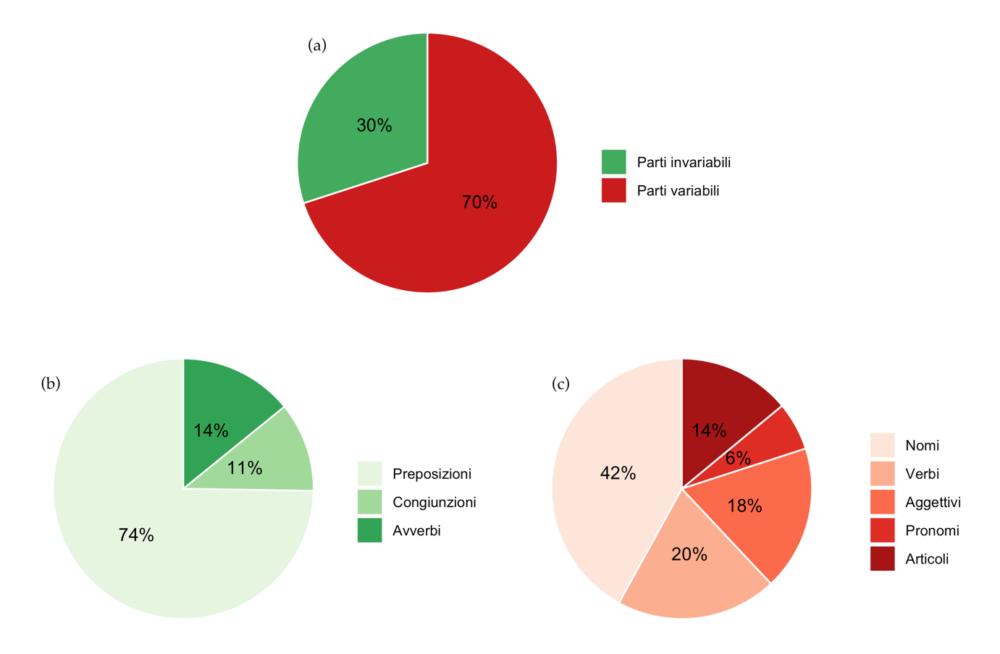
```

Given the large number of terms present within the documents, the different distributions by year of the parts of speech are almost identical. Therefore, analyzing their variations over the period of time considered makes little sense. It is interesting, instead, to observe the average distribution of the nine parts of speech of the Italian language. The latter is represented in Figure \@ref(fig:a).  

Graph (a) shows that 30% of the data consists of invariable parts of speech, that is, prepositions, adverbs, conjunctions and interjections. In particular, as is clear from graph (b) which shows the distribution limited to this section of the data, most of the invariable parts of speech are prepositions (74%), followed by adverbs (14%) and conjunctions (11%). It is important to note the total absence of interjections in the observed texts. The reasons for this result certainly lie in the fact that exclamations express a particular emotional attitude of the author, which cannot be found in official publications such as those under analysis, to which a formal register is appropriate.  
Considering, instead, graph (c) of Figure \@ref(fig:a), we can observe the average composition of 70% of the treatises, made up of the variable parts of speech. Even in this case there is one type, that of nouns, which is much more present than the others: it makes up almost half (46%) of the total. Verbs, adjectives and articles, on the other hand, are present in almost similar proportions, amounting respectively to 20, 18 and 14% of the total of the variable parts. Last we find pronouns, which contribute only 6%.
The results observed, characterized by a rich distribution of nouns at the expense of adjectives, together with the absence of interjections, are in line with the textual typology analyzed. In fact, these particularities reflect those which, in linguistics, are proper to an expository text with scientific language, therefore objective. Moreover, we expect the latter to be denotative, therefore limited to the explicit and referential meaning of the word, without any freedom of interpretation.  


## Lexical characteristics
```{r, label = "b", echo=FALSE, fig.cap= "Overview of lexical features of the data over the reporting period", fig.align="center"}
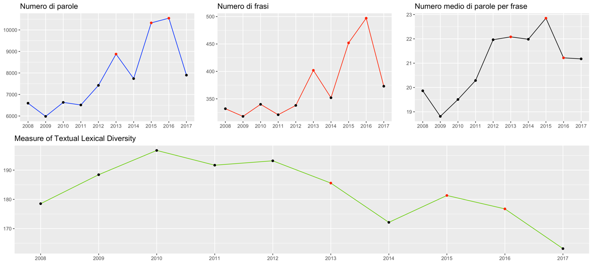
```

Figure \@ref(fig:b) provides an overview of the number of total words and sentences, the average number of words per sentence, and the MTLD index of the publications for each year of the 2008-2017 period. From the first two graphs, we easily notice how, as time goes on, the Governor's Final Remarks tend to be longer and more comprehensive. The total number of words and sentences, in fact, after a minimum reached in 2009 (5982 words in 318 sentences), tends to increase in the interval up to 2017. Three peaks are easily observed, one of which is less significant in 2013 and two very relevant ones related to the years 2015 and 2016, which present, respectively, a number of words equal to 8877, 10328 and 10546 (against a ten-year average of 7853) and a number of sentences equal to 402, 452 and 497 (average equal to 373). The three observations from these three years are marked with a red dot in the graphs in Figure \@ref(fig:b).  

Shifting our attention to the graph regarding the average number of words per sentence, we observe a positive trend here as well, but a more stable one. We note, in fact, a jump between 2011 and 2012, in which we vary from sentences averaging 20.29 words long to sentences averaging almost 22 (21.96) words, but fairly stable values for the periods before and after the break. Again, the minimum is reached in 2009 (18.81) and the maximum in 2015 (22.85), compared to a total average of 20.97. The documents referring to the years 2013 and 2016, despite being the longest ones, show average values related to the length of the sentences that are little different from the average of the period 2012-2017, equal to 21.88.  

The fourth graph in Figure \@ref(fig:b) shows the values of the MTLD index, which reflects the lexical richness of the texts. We observe very different results from those presented so far: if previously we noticed an increasing trend as time goes by, now the index of interest is distributed with a descending trend over the observation period. In fact, after a peak reached in 2010, where an MTLD index equal to 196.73 is recorded, with the passing of the years the value of the data has decreased until the minimum observed in the last year of interest, equal to 163.17.  

Focusing attention on the overall comparison between the periods 2008-2010, when Mario Draghi was in office, and 2011-2017, when the Governor was Ignazio Visco, we can draw some interesting conclusions. It is clear, in fact, that in the last period of Draghi's tenure, there was a preference for more streamlined treatises, with fewer words and shorter sentences on average, in favor of a richer lexicon. The documents drawn up by Visco, on the other hand, are more exhaustive, composed of longer sentences on average and characterized by a lower lexical richness.  

```{r, label = "c", echo=FALSE, fig.cap= "Comparison between average sentence length and lexical richness index", fig.align="center"}
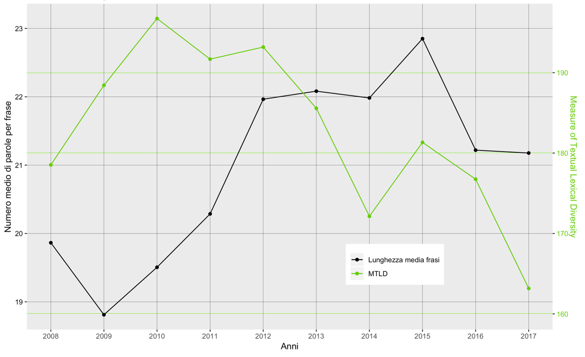
```

Moreover, if we study the comparison between the average length of sentences and the MTLD index, available in Figure \@ref(fig:c), we come to further interesting results. The graph compares the trend of the average number of words per sentence, in black, and that of the lexical richness index, in green. It is easy to see how the two trends are opposite. That is, as time goes by, the sentences are, on average, longer and the terms present within them, on average, less sought after. Adopting a linguistic view of the data, we can conclude that longer and more complicated sentences, and therefore probably texts characterized by more subordination, correspond to the use of a less extensive vocabulary.

## Wordcloud by periods

```{r, echo=FALSE, fig.cap= "Wordcloud lemmatized referred to the period 2008-2010", fig.align="center", label = "d"}
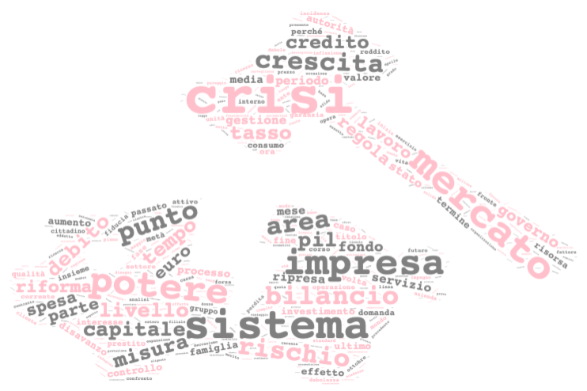
```

Figure \@ref(fig:d) shows the cloud of words made up of the headwords present in the Final Considerations of the Governor in 2008, 2009 and 2010. It can be seen immediately that the most important words, i.e., those that recur most in the texts and, therefore, those that appear largest in the graph, are crisis, system, market, power and enterprise. It is clear that the publications reflect the situation of the Italian economy in the period of reference, in which Italy was in times of absolute crisis. It is likely, therefore, that they were talking about a crisis involving the market, the enterprise, or even the entire system. In the cloud we also find terms that relate to the conditions underlying the economic situation of the time, i.e. the high level of debt in relation to GDP, the low or absent economic growth and the lack of credibility of those in power.

```{r, echo=FALSE, fig.cap= "Wordcloud lemmatized referred to the period 2011-2014", fig.align="center", label = "e"}
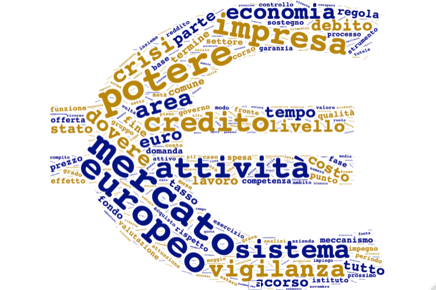
```

Shifting our attention, instead, to the word cloud referring to the years from 2011 to 2014 depicted in Figure \@ref(fig:e), we can draw different conclusions. Although terms linked to the crisis are still very present, a situation that we also find in the graph previously described, the importance of the term European provides a different interpretation. It can be seen, in fact, that in the period of reference, financing provided by the European Union played a primary role in lifting the country out of the crisis. In addition, the relevance of the supervisory activity carried out by the European Central Bank in the euro area, necessary to maintain financial stability and, therefore, to improve the general situation of the economy, has increased. Finally, the help provided by the Community is also underlined by the importance acquired by terms such as credit and fund, given that the monetary contribution is provided through various European Funds.

```{r, echo=FALSE, fig.cap= "Wordcloud lemmatized referring to the period 2015-2017", fig.align="center", label = "f"}
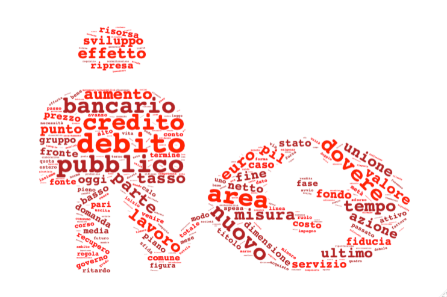
```

The word cloud referring to the years 2015, 2016 and 2017, shown in Figure \@ref(fig:f), also reflects the situation of the Italian economy in that period. In fact, with the passage of time, aid from the European Union continued to be used, but the situation did not improve. This has led to the public debt (words most present in the treatments considered) increasing to historic highs[(22)][References].  It is likely, therefore, that it constituted a primary problem of the country and, therefore, of ample treatment in the final considerations of the Governor.

## Comparison cloud and commonalty cloud

```{r, echo=FALSE, fig.cap= "Lemmatized comparison cloud of the three periods", fig.align="center", label = "g"}
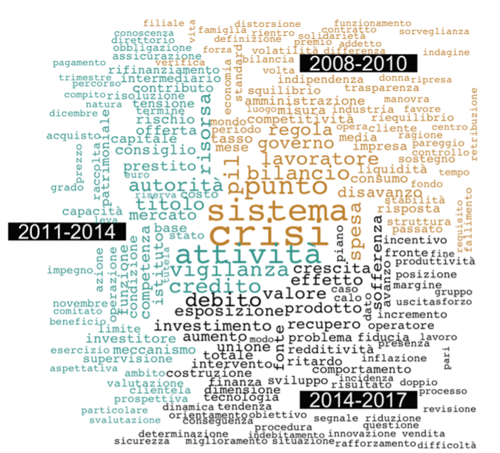
```

Figure \@ref(fig:g) and Figure \@ref(fig:h) allow us to observe the differences and similarities in the terms present in the documents.  

The comparison cloud (Figure \@ref(fig:g)) describes the lemmas that characterize one period rather than another, that is, it presents a term as belonging to one of the groups only if the latter is significantly more present in the reference class than it is in the others. Referring to our example, this means that the fact that the words crisis and system are linked to the first period reflects that, although they are present in all three groups of documents, they are more frequent in the years 2008, 2009, and 2010. It is interesting to note the absence, respectively in the second and third groups, of the terms European and public, which are fundamental for the conclusions drawn above. Finally, lemmas related to supervisory activity and debt remain discriminating.  


```{r, echo=FALSE, fig.cap= "Lemmatized commonalty cloud", fig.align="center", label = "h"}
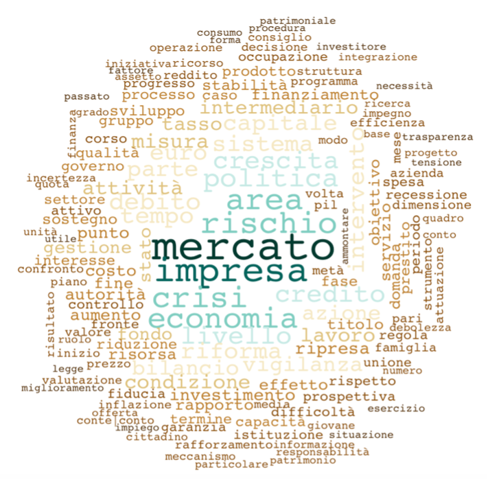
```

The commonalty cloud (Figure \@ref(fig:h)), on the other hand, presents the words that are most common to all documents, the larger the size of the minimum frequency between documents. In the graph, therefore, we find the general topics that the publication deals with, such as the market, the company and the economy, but also the budget, the politics, the growth of the Italian area.  

Finally, it is interesting to note that words such as crisis, risk, credit or debt are frequent throughout the documents. This is evidence of the fact that the period analyzed was characterized by a turbulent economic situation.  

## Positivity of the lemmas

```{r, echo=FALSE, fig.cap= "Concentration of positive lemmas: comparison of results obtained with different lexicons", fig.align="center", label = "i"}
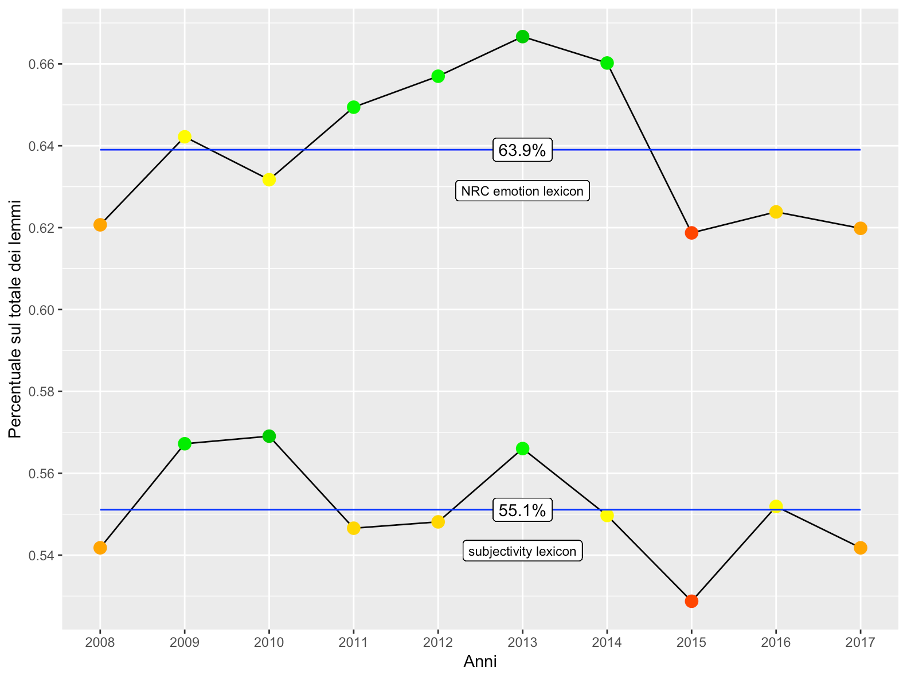
```

As described in the previous chapter, the opinion mining procedures were performed by using two different lexicons. In Figure \@ref(fig:i) it is possible to observe the comparison between the concentrations of positive lemmas within the ten documents obtained from the two dictionaries. It is important to note that all observations are arranged above the 50% threshold, meaning that most of the lemmas in the publication, despite being used objectively to discuss topics that are not always happy, reflect a positive opinion of the author. This observation is much more relevant in the results obtained through the use of the NRC emotion lexicon. The latter, in fact, present much higher concentrations of positive lemmas, as can be seen by comparing the averages: 63.9% of the data obtained with the NRC emotion lexicon, 55.1% with the subjectivity lexicon. 
Moreover, as regards the trends, it can be seen that these are similar and characterized by a peak of positive polarity, reached in 2013, and an absolute minimum, recorded in the year 2015 (to which corresponds, therefore, the highest concentration of negative opinion).


```{r, echo=FALSE, fig.cap= "Trend in the concentration of positive lemmas (NRC emotion lexicon)", fig.align="center", label = "j"}
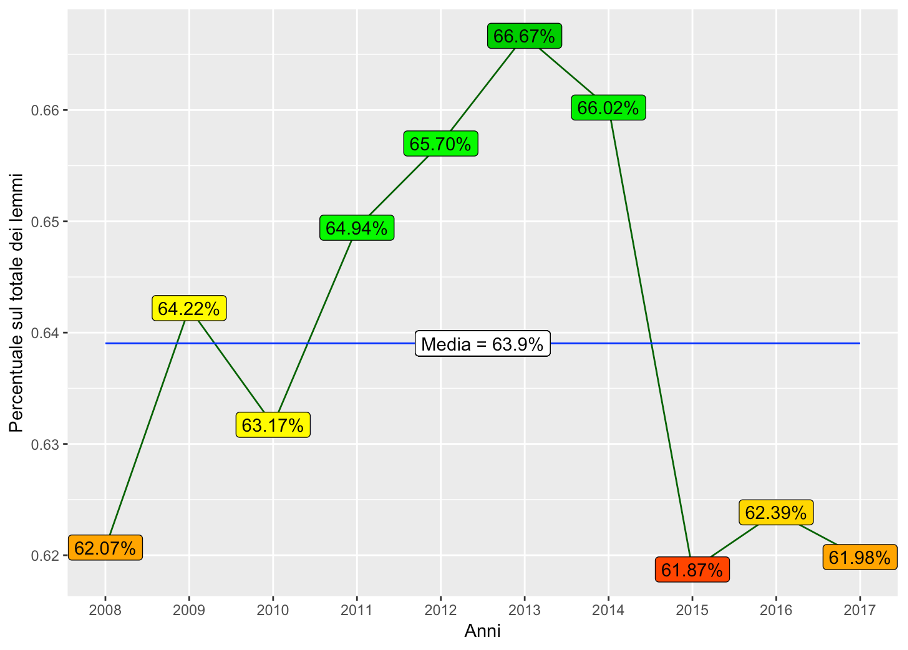
```

Of the two dictionaries, the one provided by the National Research Council Canada performed better in terms of recognizing the polarity of terms. It makes more sense, then, to analyze in detail the results obtained from this dictionary, shown in Figure \@ref(fig:j).  

There is little variation in the performance, with a range of just under 62% to almost 67%, which is little different from the overall average of 63.9%. Moreover, it is easy to distinguish three periods characterized by a similar concentration of positive lemmas. The first includes the years 2008, 2009 and 2010 and is characterized by results close to the overall average, especially for the years 2009 and 2010; the average number of observations in this period is, in fact, 63.2%. The second period, on the other hand, corresponds to the years 2011 to 2014 and shows concentrations decidedly above the intermediate value. In fact, the relative average is 65.8%. Finally, the publications of 2015, 2016 and 2017 are characterized by a significantly lower presence of positive lemmas: the average value referred to these last three years is 62.1%.


## Topics of the parts of the text
```{r, echo=FALSE, fig.cap= "Four headwords most likely to be part of the four topics in each of the ten publications", fig.align="center", label = "k", out.width="100%"}
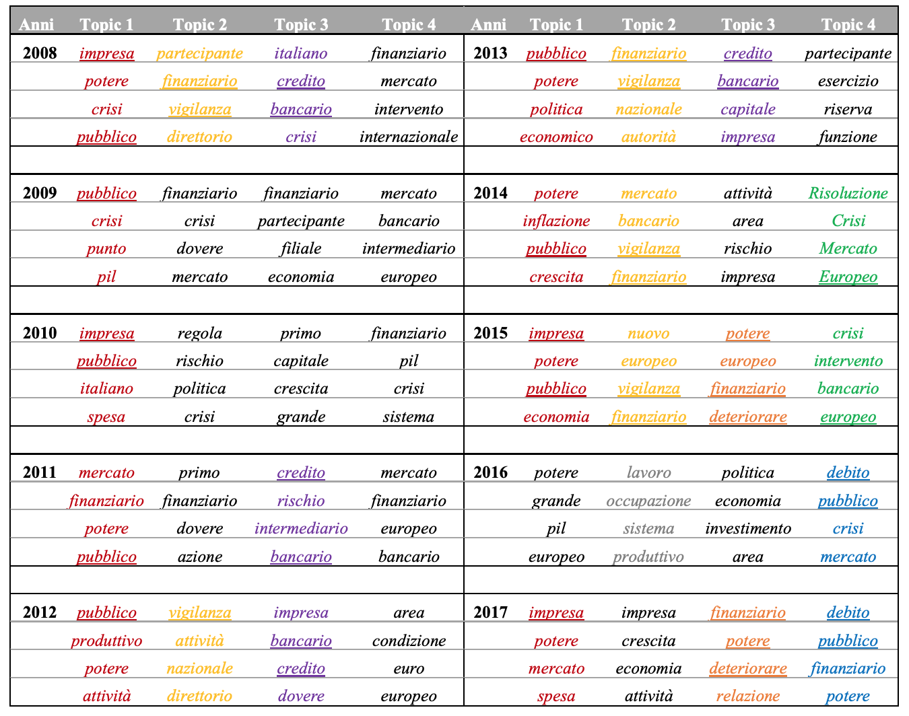
```

The application of the LDA algorithm resulted in the lemmas that are most likely to be jointly present within one section of the text rather than another. This means that these four words are the ones that best define the topic they refer to. Therefore, from an analysis of these terms it is possible to reconstruct the four topics addressed in each document and, consequently, to observe if there are any recurrences.  

The table in the Figure \@ref(fig:k) summarizes the 16 terms of each publication, so that you can get an overview and interpret them better. An example of the output of R is instead provided in Figure \@ref(fig:l).

```{r, echo=FALSE, fig.cap= "Average distribution of parts of speech (a), especially invariables (b) and variables (c)", fig.align="center", label = "l"}
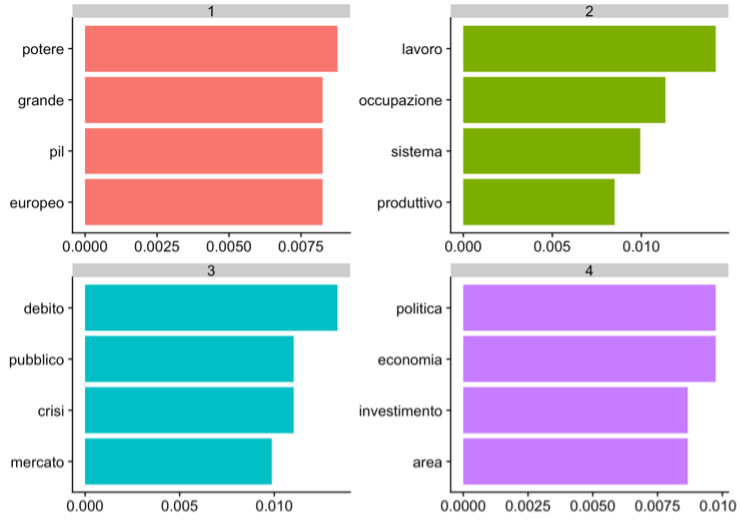
```

The graph refers to the results obtained by analyzing the Governor's Final Considerations regarding the year 2016. It is possible to observe the four lemmas that most characterize a given topic and the probability connected to them of belonging to the topic in question. This means, for example, that the lemmas debt, public, crisis and market are those that with greater probability refer jointly to one of the four topics (3, in the graph). This means, likely, that in the 2016 paper one section deals with the issue of public debt and market crisis.  

For each year, therefore, the keywords have been reorganized in the table in the Figure \@ref(fig:k). Following a careful analysis, it is possible to recognize different groups of recurrent words. The most present is certainly that referring to the lemmas business and public, often accompanied by power (in red in the table). It can be said, therefore, that in 9 documents out of 10, a section of the text is dedicated to the description of the situation of businesses in the market, or to the problem of the consolidation of public accounts (i.e. the state budget). Another recurring topic is that of banking and financial supervision activities carried out by the Bank of Italy at the national level, present in 5 sections and highlighted in yellow. We also often find topics linked to the central role played by banks in financing the Italian economy. On 4 occasions, in fact, we can observe groups containing the lemmas credit and banking (in purple). Moreover, we observe recurrent topics that characterize only a few documents. Clear examples are those highlighted in green, orange and blue, which we find only in two of the last four years in analysis and refer respectively to the European market in relation to the crisis, the deterioration of financial power and the issue related to public debt. It is also interesting to note how in 2016 the theme of work gains importance (in gray), likely due to the anti-unemployment policies introduced in those years.  

Finally, it can be observed how the terms crisis and public debt are present above all in the first and third macroperiod of treatment respectively. Words related to the European market, instead, are frequent throughout the table. This almost perfectly mirrors the results observed through the analysis of word clouds.