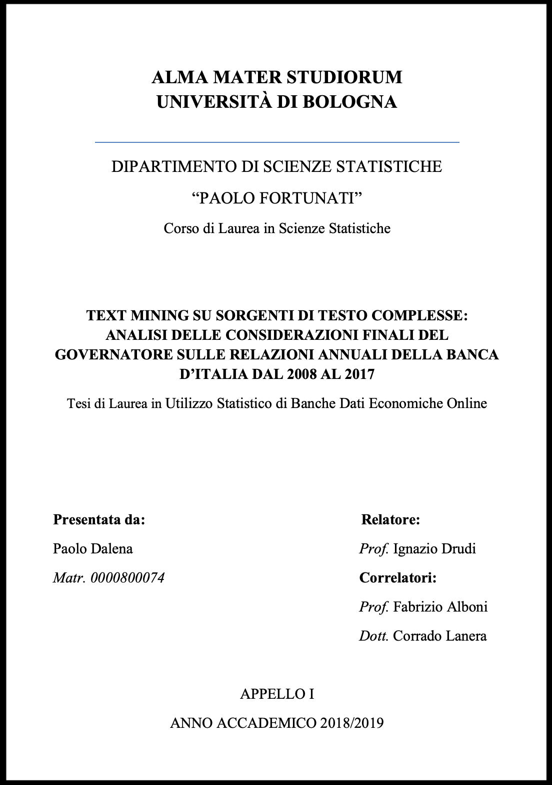

--- 
title: "TEXT MINING ON COMPLEX TEXT SOURCES: ANALYSIS OF THE FINAL CONSIDERATIONS OF THE GOVERNOR ON THE ANNUAL REPORTS OF THE BANK OF ITALY FROM 2008 TO 2017"
author: "Paolo Dalena"
date: "`r Sys.Date()`"
site: bookdown::bookdown_site
output: bookdown::gitbook
documentclass: book
bibliography: [book.bib, packages.bib]
biblio-style: apalike
link-citations: yes
github-repo: rstudio/bookdown-demo
description: "This is the English version of my Bachelor Thesis - TEXT MINING ON COMPLEX TEXT SOURCES: ANALYSIS OF THE FINAL CONSIDERATIONS OF THE GOVERNOR ON THE ANNUAL REPORTS OF THE BANK OF ITALY FROM 2008 TO 2017"
---

# Preface to the English version {-} 

 This is the English version of my Bachelor Thesis **"TEXT MINING SU SORGENTI DI TESTO COMPLESSE: ANALISI DELLE CONSIDERAZIONI FINALI DEL GOVERNATORE SULLE RELAZIONI ANNUALI DELLA BANCA D'ITALIA DAL 2008 AL 2017"** that I wrote for the [Bachelor in Statistical Sciences](https://corsi.unibo.it/1cycle/StatisticalSciences) degree I received on July 10, 2019 at [Alma Mater Studiorium - University of Bologna](https://www.unibo.it/en/homepage).  
You can find the link to the Github page of my workflow [here](https://github.com/PaoloDalena/tesi) and the official published documents [here](https://github.com/PaoloDalena/tesi/tree/master/Tesi_docs).  
Everything, for obvious reasons, is in Italian, so this online book is born to allow more people to understand my work.  
**Please note that the text has been automatically translated, so it's quite likely to find any linguistic (and other) inaccuracies.**  
If you find anything wrong, please report it [here](https://github.com/PaoloDalena/bachelor_thesis_book/issues). I will be happy to help you understand or (more likely) correct the errors.

